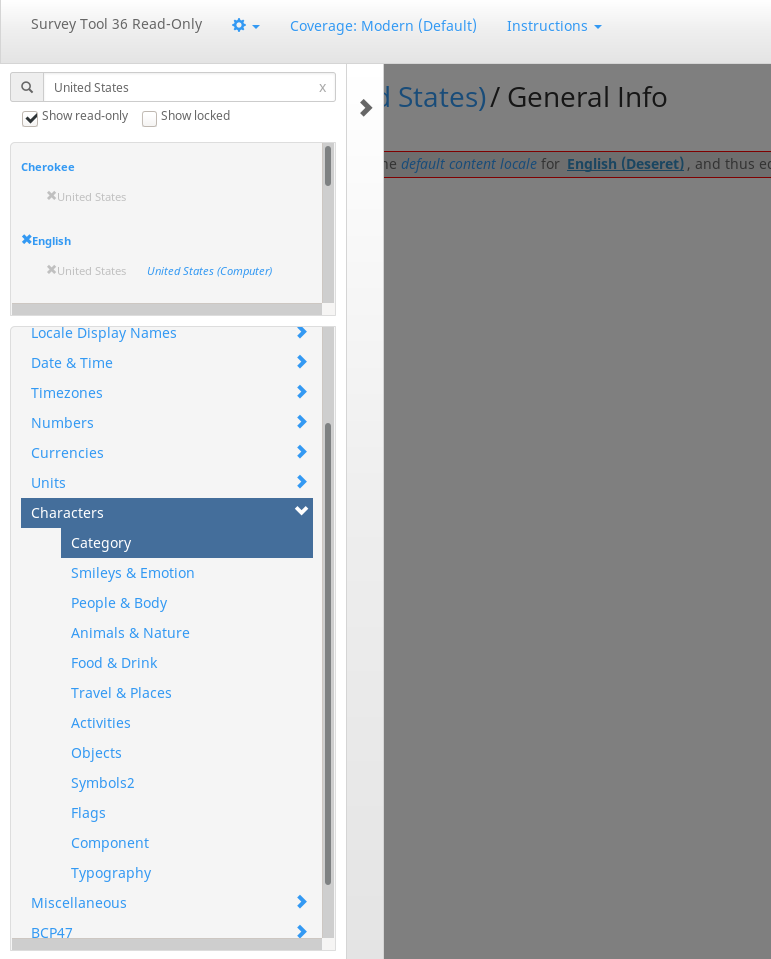

Nice to see you want to contribute to this project! :+1: :tada:
Please have a look at this guide to know what you are changing.

As I do not want to duplicate the instructions all over, please **find the common contributors docs here**: https://github.com/TinyWebEx/common/blob/master/CONTRIBUTING.md

Some links and potential special rules for this repo only are listed below.

## Support us!

You like this add-on, but have no idea how to support us?

Here are some easy things you can always do:

* Spread the word and recommend it to others! 🤗😍
* Leave a rating [at addons.mozilla.org](https://addons.mozilla.org/firefox/addon/awesome-emoji-picker/reviews/?utm_source=github.com&utm_medium=git&utm_content=contributor-doc-rate-extension&utm_campaign=github-contributor-doc-rate-extension) if you like it!
  Also consider writing some text and not only leaving stars there. It's always nice to hear some warm words. ☺️
* Star this project [on GitHub](https://github.com/rugk/awesome-emoji-picker) by clicking the "star" icon!
* Leave a [review at alternativeto.net](https://alternativeto.net/software/-awesome-emoji-picker-/reviews/) and click the like button there, if you want. (Also, you can obviously recommend this add-on as an alternative to other emoji pickers.)

## Translations

It would be great if you can contribute your translations! You can either translate the JSON files directly or use [this online translator service](https://lusito.github.io/web-ext-translator/?gh=https://github.com/rugk/awesome-emoji-picker).

**Manually:** To translate it manually, go to [`src/_locales/en`](src/_locales/en) and copy the English (or any other existing language) `messages.json` file. (You could also use another source language if you want, but usually English is the best.) Create a new dir at `src/_locales` with the abbreviation of the language you want to translate.  
**Web-ext-translator:** Go to [this page](https://lusito.github.io/web-ext-translator/) and translate it online. Download the result by clicking on "Export to ZIP" at the bottom.

At the end, just submit a Pull Request with your changed files.
Of course, you can (and should) improve existing translations.

For more details, [see the official docs](https://developer.mozilla.org/Add-ons/WebExtensions/Internationalization#Providing_localized_strings_in__locales).

### Other items to translate

* Text assets to translate: [`assets/texts`](assets/texts)
* Screenshots: [`assets/screenshots`](assets/screenshots)
* Wiki to translate: [wiki](../../wiki)
* Sidebar file for adding language: [`_Sidebar` file](../../wiki/_Sidebar/_edit)

For more information, see the whole [contributing doc](https://github.com/TinyWebEx/common/blob/master/CONTRIBUTING.md#translations).

### Translating emoji terms (categories, skin names etc.)

**Big tip** for translators: If you translate the `emojiMart*` entries, notice that you will likely find correct translations somewhere for these specific emoji terms.

Actually, it's standardized, because emojis are also standardized. It's Unicode, after all!

So the point to look for correct translations is the Unicode [Common Locale Data Repository](http://cldr.unicode.org/) (**CLDR**, see [their Wikipedia entry](https://en.wikipedia.org/wiki/Common_Locale_Data_Repository)). You can download the data there and then try to find the correct term. (I did that, and I know it's hard to find, but yes, it must be somewhere in there!)

You can also try to use [the survey tool](https://st.unicode.org/cldr-apps/v#locales///) and look in the section “Characters”:

Related:

* [discussion at emoji-mart of whether to bundle the translations inside of the library](https://github.com/missive/emoji-mart/issues/303)
* [same discussion for their upstream project emoji-data](https://github.com/iamcal/emoji-data/issues/148)

## Coding

See the **common guide** on how to [start coding](https://github.com/TinyWebEx/common/blob/master/CONTRIBUTING.md#coding) and what rules to follow.

**Attention:** For this add-on, you need to execute [`scripts/downloadEmojiImages.sh`](scripts/downloadEmojiImages.sh) to download the bundled emoji sheets if you use anything else than the "native emojis" ("emojis from your OS") in the settings of this add-on. The reason is just, that these big files are not bundled/distributed in this repo.

### Tests

* Test dir: [`src/tests/`](src/tests/)
* EsLint config for tests: [`src/tests/.eslintrc`](src/tests/.eslintrc)

## Need ideas?

Don't have any idea what to take up? [Here you can find a list of good issues for starters](../../contribute), e.g. if you want to start with this project or a (programming) language in general.
However, of course, feel free to take on any issue (that is not claimed or assigned to someone else).

Also, there are other add-on's, which are very similar and may also need work:

* [Offline QR Code Generator](https://github.com/rugk/offline-qr-code/contribute)
* [Mastodon Simplified Federation](https://github.com/rugk/mastodon-simplified-federation/contribute)
* [How did I get here?](https://github.com/rugk/how-did-i-get-here/contribute)
* [Dark Mode Website Switcher](https://github.com/rugk/website-dark-mode-switcher/contribute)

There is also [an overview over all good first issues in other add-on repos](https://github.com/issues?utf8=%E2%9C%93&q=is%3Aopen+is%3Aissue+archived%3Afalse+user%3Arugk+user%3ATinyWebEx+label%3A%22good+first+issue%22). Also [check out the libraries used by this project](https://github.com/TinyWebEx).
